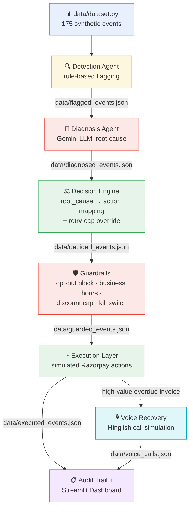

# AI Revenue Recovery Agent

## Pitch
An AI agent that detects revenue at risk from failed payments, abandoned checkouts, and overdue invoices, diagnoses root cause, and executes a bounded recovery workflow.

## Problem Statement
Businesses lose significant revenue due to easily recoverable failed payments. Current manual retry processes are inefficient, non-personalized, and often lead to poor customer experiences.

## Architecture Overview
Detection Agent -> Diagnosis Agent -> Decision Engine -> Execution Layer -> Guardrails -> Audit Trail


## Tech Stack
- Python
- Streamlit
- Gemini API
- Razorpay API

## Setup Instructions
1. Clone the repository.
2. Install dependencies: `pip install -r requirements.txt`
3. Copy `.env.example` to `.env` and fill in the required API keys:
   ```bash
   cp .env.example .env
   # Edit .env and add your keys
   ```
4. Run the application: `streamlit run app.py`

## Status
Under active development for Razorpay Buildathon 2026.
