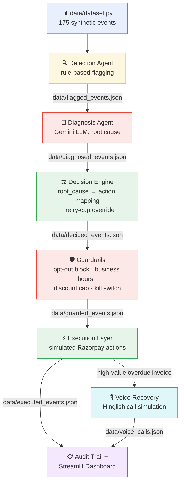

# AI Revenue Recovery Agent

**Razorpay Buildathon 2026 — Track 03: AI Revenue Recovery**

An AI agent pipeline that detects revenue at risk from failed payments, abandoned
checkouts, subscription failures, and overdue invoices — diagnoses the root cause
using an LLM, and executes a bounded, guardrailed recovery workflow. Includes a
Hinglish voice call simulation for high-value overdue invoices.

---

## The Problem

Payment failures, checkout drop-offs, and overdue invoices quietly leak revenue
that is often perfectly recoverable — a card just expired, a gateway timed out,
a customer simply forgot. Manual follow-up on this doesn't scale, and naive
"retry everything" automation risks spamming customers, violating opt-outs, or
retrying indefinitely on genuinely failed transactions.

This project builds an AI pipeline that finds this at-risk revenue, understands
*why* each event happened, decides on a bounded recovery action, and — critically —
enforces hard safety limits before anything actually executes.

---

## Architecture



**Pipeline stages:**

| Stage | What it does |
|---|---|
| **Detection Agent** | Scans all events, flags revenue at risk with a computed priority score |
| **Diagnosis Agent** | Gemini LLM classifies root cause (card expired, insufficient funds, gateway timeout, customer dispute, no engagement) |
| **Decision Engine** | Maps root cause to a bounded action (retry now/later, send reminder, offer discount, escalate to human); force-escalates after 3 failed retries regardless of cause |
| **Guardrails** | Pre-execution safety gate — blocks contact to opted-out customers, holds customer-facing actions outside business hours (8AM–9PM IST), caps discount amounts, includes a kill switch |
| **Execution Layer** | Simulates the actual Razorpay-side action and logs the result |
| **Voice Recovery** | For high-value overdue invoices, generates and speaks a Hinglish reminder script (Gemini + gTTS), simulates the customer's spoken response, and extracts a promise-to-pay |
| **Streamlit Dashboard** | One-click pipeline run, live metrics (₹ at risk, ₹ recovered, recovery %), and a fully filterable audit trail |

A key design decision: **"₹ Recovered" only counts events where a retry actually
succeeded** — reminders sent and discounts offered are tracked separately as
"in progress," not counted as recovered revenue, since they haven't converted yet.

---

## Tech Stack

- **Python** — core pipeline
- **Streamlit** — dashboard / working app
- **Gemini API** (`gemini-flash-lite-latest`) — root cause diagnosis, decision reasoning support, Hinglish script generation, promise-to-pay extraction
- **gTTS** — Hinglish voice synthesis
- **Razorpay test-mode API** — simulated payment actions
- **Faker** — synthetic dataset generation

---

## Setup Instructions

1. **Clone the repository**
   ```bash
   git clone <repo-url>
   cd ai-revenue-recovery
   ```

2. **Install dependencies**
   ```bash
   pip install -r requirements.txt
   ```

3. **Configure environment variables**
   ```bash
   cp .env.example .env
   ```
   Edit `.env` and add your keys:
   ```
   GEMINI_API_KEY=your_gemini_api_key
   RAZORPAY_KEY_ID=your_razorpay_test_key_id
   RAZORPAY_KEY_SECRET=your_razorpay_test_key_secret
   ```
   Get a free Gemini API key at [aistudio.google.com](https://aistudio.google.com/app/apikey).

4. **Generate a fresh dataset** (event timestamps are relative to "now," so regenerate before each demo)
   ```bash
   python data/dataset.py
   ```

5. **Run the app**
   ```bash
   streamlit run app.py
   ```

6. Click **"▶ Run Batch Pipeline"** in the dashboard to run the full pipeline end-to-end, then try **"Simulate Voice Call for Top Overdue Invoice"** to hear the Hinglish voice recovery flow.

> **Note:** Voice call results are cached per event in `data/voice_calls.json`. If you regenerate the dataset, delete this file and the corresponding `.mp3` in `data/voice_calls/` to get a fresh simulation.

---

## Project Structure

```
├── app.py                      # Streamlit dashboard (main entry point)
├── voice_recovery.py           # Hinglish voice recovery simulation
├── agents/
│   ├── detection_agent.py
│   ├── diagnosis_agent.py
│   ├── decision_engine.py
│   ├── guardrails.py
│   └── execution_layer.py
├── data/
│   ├── dataset.py               # synthetic data generator
│   ├── customers.json           # 40 synthetic customer profiles
│   ├── sample_data.json         # 175 synthetic events
│   ├── flagged_events.json      # → Detection Agent output
│   ├── diagnosed_events.json    # → Diagnosis Agent output
│   ├── decided_events.json      # → Decision Engine output
│   ├── guarded_events.json      # → Guardrails output
│   ├── executed_events.json     # → Execution Layer output (audit trail source)
│   ├── voice_calls.json         # → Voice Recovery output
│   └── voice_calls/*.mp3        # generated call audio
├── utils/config.py             # environment variable loading
├── docs/                        # architecture notes
├── pitch_script.md              # 5-minute demo script/storyboard
└── requirements.txt
```

---

## Demo

See [`pitch_script.md`](./pitch_script.md) for the full walkthrough script used in
our demo video, covering: live pipeline run → recovery metrics → guardrails in
action (opt-out blocking, business-hours holds) → Hinglish voice recovery call →
architecture summary.

---

## Known Limitations / Honest Notes

- Uses the deprecated `google.generativeai` SDK rather than `google.genai` — a
  deliberate choice made mid-build to avoid destabilizing a working pipeline
  close to the deadline.
- gTTS provides free, dependency-light Hinglish speech synthesis but sounds more
  robotic than a commercial TTS provider (e.g. ElevenLabs) would; a production
  version would swap this out.
- Dataset is synthetic (Faker-generated) with intentional edge cases (₹0 amounts,
  duplicate event IDs, orphan customer IDs, null timestamps) to stress-test the
  pipeline's error handling.
- Razorpay actions are simulated, not live — this is a test-mode / hackathon
  build, not a production integration.

---

## Status

Feature-complete for Razorpay Buildathon 2026 submission (deadline 05/09/2026).